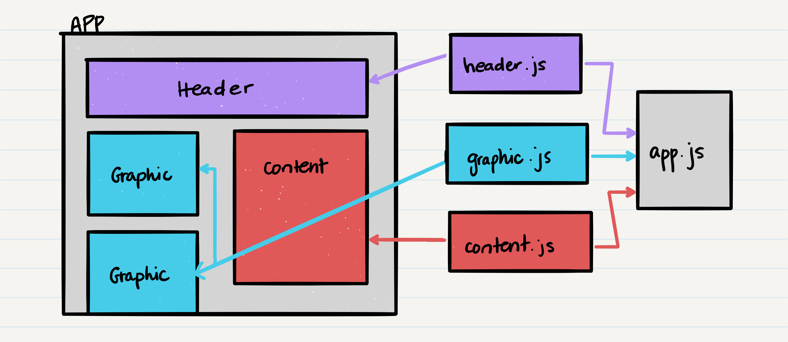
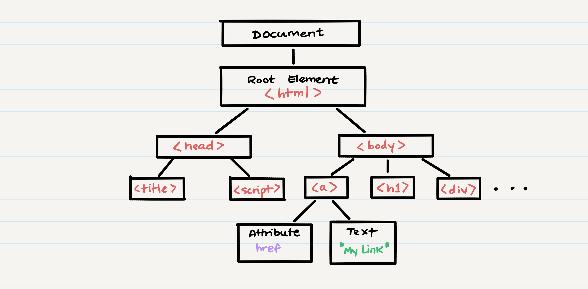

# Class 21 --- Component Based UI

## Lecture Videos

[Saturday Morning]() || [Saturday Afternoon]()

## Lecture Overview

Congratulations on making it through the first half of this course! For the next few weeks, we will be focusing fully on building front end web applications. This encompasses everything an end user sees in their browser; home pages, web forms, etc. To build our web applications, we will be using the JavaScript library, React.

At the end of this class, you'll be able to:

-   [x] Define SASS
-   [x] Understand component architecture
-   [x] Understand _state_
-   [x] Understand the difference between ecosystem, library and framework
-   [x] Build a basic Hello World React application
-   [x] Update a component's state variables
-   [x] Apply SASS styling to a component

Prior to class, review the readings below and answer the discussion questions in your reading repository.

## Reading

So far, we've been spending a lot of time creating web applications without a client-side / front-end. With this constraint, we have learned:

-   How to make classes so that we can define our own object types
-   How to store and read data from a database so that our applications "persist" information
-   How to use an express server to create an API
-   How data is sent over the internet via HTTP and TCP
-   How to communicate events between applications in real time

Now, it's time to shift our focus to the front-end. While you may be familiar with creating websites using HTML files and JQuery-enabled JavaScript files, we're going to dive into a different way of thinking about our websites. We're going to see what it looks like when our HTML and JavaScript _is in the same file_, and when our web pages are broken up into modular pieces. We'll be doing this using a library called **React**.

Before we dive further into React, let's first understand the difference between **ecosystem**, **library** and **framework**. Ecosystems are the environment in which our code executes. Node.js is an example of an ecosystem - the primary purpose of Node.js is to efficiently compile and run our JavaScript code, with or without a browser's involvement. A library is a collection of tools that you can use to speed up complex development processes. You can call upon those tools wherever you see fit in your application. A framework, on the other hand, sets up rigid places for you to add your code, and the framework is what controls when certain pieces of code are called.

React was created in 2011 by a Facebook engineer, with the goal to improve how UIs were developed for web applications. Originally, making a UI involved long HTML pages that were pretty disjoint from one another. If you had the same Header or NavBar on every page in your application, you'd have to copy-paste that HTML code in every HTML file.

By using React, we'll be able to create a modular **components** for that Header or NavBar (or any other piece of UI). This will allow us to have one **JSX** file defining our component, and any changes we make to that file will propagate throughout our application.

> JSX stands for "JavaScript XML", and refers to React JavaScript files which allow for JavaScript and HTML to be seamlessly mixed together. The only requirement is that the HTML code is enclosed in parentheses `()`



These modular components can either be classes or functions, and they can maintain a **state**. The state of a component refers to a collection of variables which trigger a structural change or **re-render** of the component.

Because the components are modular, they can then be imported, duplicated and shared around multiple files, and thus your application composition can be neatly defined.

The basic structure of each component is some JavaScript logic and some HTML to "**render**". Here, render means to build and display the HTML element(s) on your webpage. When a component is rendered, it appears on the page and within the **DOM**.

> DOM stands for "Document Object Model", and refers to how an HTML page is interpreted and stored, so that pieces can be dynamically changed. The DOM of an HTML page will break up the page into a tree structure, as shown below:



By changing a component's state variables, you can trigger a re-render of the component, which means that React will "rebuild" that HTML block within the DOM.

There are two major ways we'll be creating React applications in this class. The first is a simple method using the [CodeSandbox](https://codesandbox.io/) tool, and the second is creating your React code locally with a helper module called [`create-react-app`](https://github.com/facebook/create-react-app). By the end of this class, you should be able to write your first React web application!

### External Reading / Viewing

Save or skim through the following links to help broaden your understanding.

| Links                                                                               |
| ----------------------------------------------------------------------------------- |
| [React Hello World](https://facebook.github.io/react/docs/hello-world.html)         |
| [Introducing JSX](https://facebook.github.io/react/docs/introducing-jsx.html)       |
| [Rendering Elements](https://facebook.github.io/react/docs/rendering-elements.html) |
| [SASS](https://sass-lang.com/)                                                      |
| [SASSmeister](http://www.sassmeister.com)                                           |
| [SASS Cheatsheet](https://devhints.io/sass)                                         |
| [React Cheatsheet](https://devhints.io/react)                                       |
| [Another React Cheatsheet](https://reactcheatsheet.com/)                            |

### Handy Code Snippets

Feel free to skim these code snippets, they are mainly here for your reference after class lectures.

#### Install and Use `create-react-app`

Note that you will need to install `create-react-app` _globally_, not locally in an application's `package.json`.

```
npm install -g create-react-app
```

```
create-react-app ./my-test-app
```

```
npm start
```

#### Importing Modules

```jsx
import React from 'react';
```

```jsx
import x from y;
```

> Here, `x` is the variable name we're going to use to refer to this module. For example, we imported the `'react'` module and set it to a variable named `React`. Likewise, `y` is the path to the file or module we're importing from. Anything in our `/node_modules` folder does not need a direct path.

```jsx
import x, {a, b} from y;
```

> Here, `x` is the default module export, and `a`, `b` are additional exports

#### Exporting Modules

```jsx
export default x;
```

> Here, `x` refers to a single class or function defined in the current file that we're exporting. The `default` keyword tells us what is exported by default, but we can add more exports if needed:

```jsx
export default x;
export a;
export b;
```

#### Sample Class Component

```jsx
import React from 'react';

class HelloWorld extends React.Component {
    constructor(props) {
        super(props);
        this.state = {};
    }

    render() {
        return;
        <div className='content'>
            <h1>Hello World!</h1>
        </div>;
    }
}

export default HelloWorld;
```

#### Sample Functional Component

```jsx
import React from 'react';

function HelloWorld(props) {
    return;
    <div className='content'>
        <h1>Hello World!</h1>
    </div>;
}

export default HelloWorld;
```

## Discussion Questions

Create a new markdown page in your reading notes repo for this class. On that page, answer the following questions. You will not be graded on correctness, but rather on your attempt to answer the question. Once you've created your new page, submit a link to that page using the canvas discussion entry field. Links should be somewhat of the format `https://USERNAME.github.io/reading-notes/class-##-reading`.

1. What is the benefit of breaking up HTML webpage content into components?
2. What is JSX? Why is it useful?
3. What can cause a render (or re-render) of a component?
4. When a render happens, how is the DOM affected
5. What is one thing a framework does that a library doesn't do?
